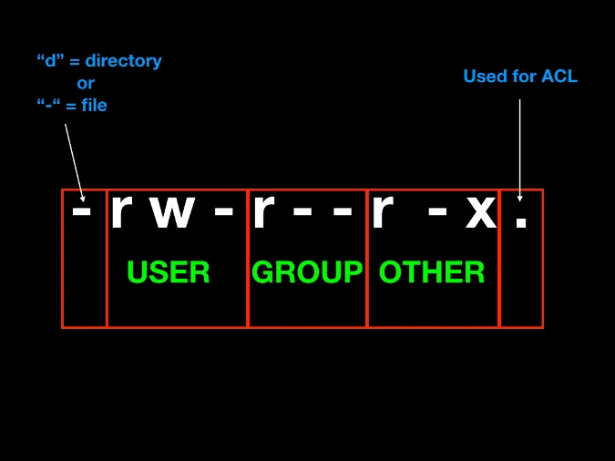

# Baimenak Linux
- [Baimenak Linux](#baimenak-linux)
  - [Fitxategi eta direktorioen baimenak](#fitxategi-eta-direktorioen-baimenak)
    - [Baimen taldeak](#baimen-taldeak)
    - [Baimenak esleitzen modu sinbolikoan](#baimenak-esleitzen-modu-sinbolikoan)
    - [Baimenak modu oktalean](#baimenak-modu-oktalean)

## Fitxategi eta direktorioen baimenak

Fitxategi eta direktorioen baimenak hurrengo aginduarekin ikusi ditzake

```bash
ls -al
```


### Baimen taldeak

- **Jabea (user)**: Fitxategi bat sortzen dugunean sortzailea jabea izango da defektuz.
- **Taldea(group)**: Fitxategi baten jabetza talde bati ere bai dagokio.
- **Bestea(other)**: Jabea edo taldekideak ez direnak 



### Baimenak esleitzen modu sinbolikoan

Linux-ek hiru baimen mota nagusi ditu: erabiltzailea (user), taldea (group) eta beste guztiak (others). Baimenak aldatzeko, `chmod` (change mode) komandoa erabiltzen da. Hemen dituzu baimen moten adibideak eta `chmod` komandoaren erabilera:

1. **Erabiltzailea (User)**: Fitxategi edo karpeta bat erabiltzaile bati nola erabiliko zaion zehazteko baimena.

   ```bash
   chmod u+x file.txt
   ```

   Hemen, `u` erabiltzaileari dagozkion baimenak aldatzen dira. `+x` fitxategia exekutagarri bihurtzen du.

2. **Taldea (Group)**: Talde bateko erabiltzaileei nola erabiliko zaie fitxategi edo karpeta bat.

   ```bash
   chmod g-w file.txt
   ```

   Hemen, `g` taldeari dagozkion baimenak aldatzen dira. `-w` idazteko baimena kentzen du.

3. **Beste guztiak (Others)**: Fitxategi edo karpeta bat beste erabiltzaile guztientzako nola erabiliko den zehazteko baimena.

   ```bash
   chmod o+r file.txt
   ```

   Hemen, `o` beste guztiak dagozkion baimenak aldatzen dira. `+r` irakurtzeko baimena ematen du.

Baimenak aldatzeko, erabilera eta sintaxiaren argibide gehiago lortzeko, `man chmod` komandoa erabil dezakezu Linux terminaletik.

Adibidez, jabeari (user) exekutatzeko baimena horrela eman ahal diogu
```bash
chmod u+x text.txt
```
Honela, taldeari eta bestei exekutatzeko eta idazteko baimenak emango diogu
```bash
chmod go+wx text.txt
```

Besteei, irakurtzeko baimena horrela kendu diezaiokegu.
```bash
chmod o-r text.txt
```

### Baimenak modu oktalean

- 0 = 000 = --- = baimenarik gabe 
- 1 = 001 = --X = exekuzio baimena
- 2 = 010 = -W- = idazteko baimena
- 3 = 011 = -WX = idazteko eta exekutatzeko baimena
- 4 = 100 = R-- = irakurtzeko baimena
- 5 = 101 = R-X = irakurtzeko eta exekutatzeko baimena
- 6 = 110 = RW- = irakurtzeko eta idazteko baimena
- 7 = 111 = RWX = irakurtzeko, idazteko eta exekutatzeko baimena

Adibidez baimen guztiak kentzeko 
```bash
chmod 000 text.txt
```

Baimen guztiak gehitzeko
```bash
chmod 777 text.txt
```

Erabiltzaileari baimen guztiak emateko eta besteei edo taldekidei irakurtze eta exekuzio baimenak emateko 
```bash
chmod 755 text.txt
```

## Sticky bit baimena

Sticky bit daukan fitxategi edo direktorio bat bakarrik jabea edo rootek aldatu ahal dio izena edo ezabatu ahal du.

Sticky bita jartzeko 
```bash
chmod +t text.txt
```
Sticky bita kentzeko 
```bash
chmod -t text.txt
```
